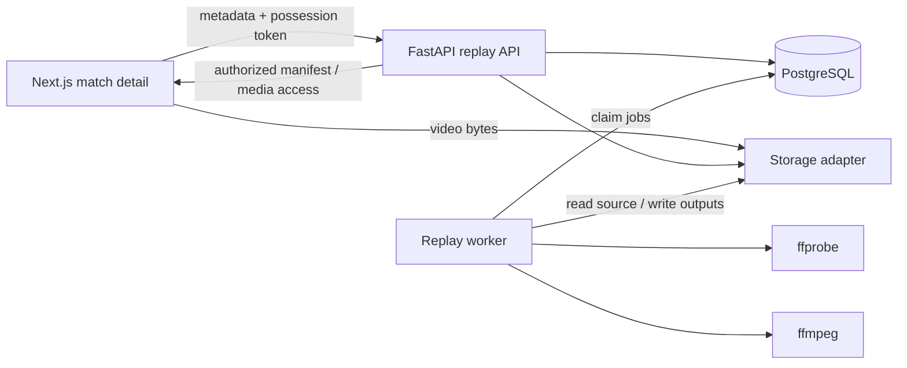

# LoL AI Coach — Replay R1 Design

**Date:** 2026-08-01

**Status:** Approved by user

**Depends on:** Phase 2 Riot integration (`feature/phase2-riot-integration`)

**Product languages:** Simplified Chinese (`zh-CN`) and English (`en-US`)

## 1. Purpose

Replay R1 adds a secure, asynchronous video-ingestion pipeline to an existing Riot match. It accepts a replay recording that the uploader owns or is authorized to use, validates and normalizes the recording, maps video time to in-game time, and produces timestamped media artifacts for later analysis.

Replay R1 is evidence infrastructure, not an AI coaching feature. It must not call OpenAI, infer player intent, score decisions, identify mistakes, or claim that a frame represents an important event. Those capabilities belong to later phases that combine Riot timeline data, replay evidence, explicit rules, and AI explanations.

The product principle is:

> A future coaching conclusion must be traceable to synchronized match data and replay evidence. Replay R1 only creates the reliable replay half of that foundation.

## 2. Scope

### 2.1 Included in R1

- Attach one uploaded video to an existing supported Riot match and selected player.
- Require an uploader authorization attestation before accepting the file.
- Upload through a local-filesystem adapter in development and an S3-compatible adapter in production.
- Validate declared size before upload and actual media contents after upload.
- Probe media with `ffprobe` and normalize it with `ffmpeg`.
- Let the user mark the video position corresponding to the in-game clock at `00:00`.
- Convert between video timestamps and in-game timestamps deterministically.
- Run long processing outside the HTTP API in a separate worker.
- Store upload, job, and artifact metadata in PostgreSQL.
- Generate deterministic verification thumbnails and retain a normalized video for later phases.
- Display upload progress, processing status, errors, thumbnails, deletion controls, and retention information in both product languages.
- Delete source and derived objects according to explicit retention rules or immediately on user request.

### 2.2 Explicitly excluded from R1

- OpenAI API calls or any other model inference.
- Coaching conclusions, mistake detection, scores, recommendations, or natural-language analysis.
- Automatic recognition of kills, deaths, objectives, map state, positioning, intent, awareness, or decision quality.
- Riot Timeline ingestion and event-driven replay window selection. This is the next Joint Evidence phase.
- Reference-video ingestion, rule mining, model training, vector search, or a high-rank player knowledge base.
- Video uploads by URL, downloading videos from third-party websites, or copying purchased/public teaching media.
- User accounts, social sharing, public replay pages, or permanent video hosting.
- Multipart/resumable uploads. R1 uses one upload request and a 4 GiB maximum.
- Additional Riot platforms beyond those already supported by the application. The schema remains platform-ready.

## 3. Success Criteria

R1 is accepted when an invited tester can open a supported match, select a local authorized recording, mark the point where game time is `00:00`, upload it, observe processing, inspect timestamped thumbnails, refresh the page without losing access in the same browser profile, and delete all associated media.

The system must also prove that:

1. The replay is bound to an existing match and the selected PUUID belongs to that match.
2. The server validates actual media contents instead of trusting the filename or browser MIME type.
3. Normalization produces a bounded H.264 MP4 artifact suitable for later deterministic extraction.
4. The time mapping produces the same answer for the same anchor and timestamp.
5. Only a client holding the replay possession token can read status, retrieve artifacts, or delete the replay.
6. Processing is idempotent and a worker restart does not produce duplicate artifacts.
7. Unsupported, oversized, malformed, or malicious-looking inputs fail safely without exposing server paths or raw tool output.
8. Retention cleanup and immediate deletion remove objects from storage.
9. The UI never presents generated thumbnails as coaching evidence or analysis.

## 4. Architecture

Replay R1 extends the existing FastAPI, PostgreSQL, and Next.js application with one separate replay worker and a provider-neutral storage boundary.



### 4.1 Component boundaries

#### Replay API

The API validates requests, verifies match ownership context, creates replay records, issues possession tokens and upload targets, finalizes uploads, returns status and artifact manifests, and handles deletion. It does not run `ffmpeg` or wait for video processing.

#### Replay service

The service owns replay state transitions and authorization policy. API routes and workers call it instead of updating replay rows directly. This keeps state rules testable and prevents route-specific transitions.

#### Storage adapter

The storage interface owns object creation, stat, streaming reads/writes, short-lived download access, and deletion. Two implementations are required:

- `LocalReplayStorage` for development and tests. Objects live below a configured directory that is not a public static directory.
- `S3ReplayStorage` for production. It uses S3-compatible APIs and presigned PUT/GET URLs without provider-specific behavior.

Database rows store opaque object keys, never filesystem paths or public URLs. User filenames are metadata only and are never used in object paths.

#### Replay worker

The worker runs as `python -m app.workers.replay`. It claims PostgreSQL jobs, probes and validates inputs, computes checksums, transcodes recordings, extracts deterministic frames, writes artifact records, and schedules cleanup. It is deployed separately from the API so long-running media work cannot block HTTP requests.

#### FFmpeg runner

The runner accepts typed argument lists and returns structured results. It never invokes a shell. It applies timeouts and resource bounds, captures diagnostic output for protected server logs, and maps known failures to stable internal error codes. Raw `ffmpeg`/`ffprobe` output is never returned to the browser.

## 5. Trust and Authorization Model

R1 has no user-account system. Each replay is therefore protected by a possession-bound opaque token.

- The create endpoint returns a cryptographically random 256-bit URL-safe token exactly once.
- The browser stores it in `localStorage` under a replay-specific key so access survives refreshes in that browser profile.
- The token is sent only in `Authorization: Bearer <token>` headers. It must never appear in a URL, query string, analytics event, or application log.
- The database stores only `HMAC-SHA256(REPLAY_TOKEN_SECRET, token)` and comparisons use constant-time equality.
- `REPLAY_TOKEN_SECRET` must contain at least 32 random bytes and is required whenever replay support is enabled.
- Replay status, completion, artifact access, retry, and deletion all require the token.
- Losing the token means losing access. R1 has no recovery mechanism because there is no verified account identity.
- The UI explains local token storage and removes the token after confirmed deletion or expiry.

The create request also requires:

- `rights_attested: true`
- `rights_statement_version: "2026-08-01"`

The localized statement says that the uploader owns the recording or has explicit permission to upload and process it. The API rejects `false`, missing, or unknown statement versions. This attestation records consent; it is not a substitute for future moderation or account controls.

R1 accepts local file uploads only. It must not accept a video URL or fetch third-party media.

For the invited beta, the production gateway limits replay creation to five requests per client IP per rolling hour, limits local upload bodies to two concurrent requests per client IP, and caps ordinary replay API traffic at 60 requests per minute. Forwarded client addresses are trusted only from configured proxy networks. The application does not log raw client IPs. Replay remains disabled in a public deployment until these gateway limits and the 4 GiB body/storage limits are active.

## 6. Replay and Match Binding

A replay is created from an existing match-detail page and includes:

- `match_id`
- `platform`
- selected `puuid`
- original filename, declared byte size, and browser content type
- `game_time_zero_ms`
- rights attestation fields

The API reads the cached match snapshot from PostgreSQL without making a new Riot request. It verifies that:

1. the match exists for the supplied platform;
2. the selected PUUID appears in the snapshot participants; and
3. match duration and identity metadata are available.

If the match is not cached, the UI instructs the user to reload the match detail before creating the replay. Replay rows intentionally do not use a database foreign key to the short-lived match cache: a cached match may expire while replay cleanup is still in progress. Instead, creation stores the immutable binding fields and the match duration needed for time mapping.

R1 allows more than one replay for the same match and player because accountless possession tokens make safe deduplication and recovery ambiguous. Gateway rate limits prevent accidental abuse. The UI reuses an existing locally known replay instead of creating another one.

## 7. Upload Contract

All JSON responses follow the existing request-ID and structured-error conventions.

### 7.1 Create upload

`POST /api/v1/replays`

Request:

```json
{
  "match_id": "NA1_1234567890",
  "platform": "NA1",
  "puuid": "selected-player-puuid",
  "original_filename": "recording.mp4",
  "declared_size_bytes": 123456789,
  "declared_content_type": "video/mp4",
  "game_time_zero_ms": 48231,
  "rights_attested": true,
  "rights_statement_version": "2026-08-01"
}
```

Response (`201`):

```json
{
  "replay_id": "uuid",
  "access_token": "returned-once",
  "status": "created",
  "upload": {
    "method": "PUT",
    "url": "local-authorized-endpoint-or-presigned-url",
    "headers": {},
    "expires_at": "ISO-8601 timestamp"
  },
  "retention": {
    "source_hours_after_processing": 24,
    "derived_days_after_ready": 7
  },
  "request_id": "uuid"
}
```

For local storage, `upload.url` points to `PUT /api/v1/replays/{replay_id}/content` and requires the bearer token. For S3 storage, it is a presigned single-object PUT valid for 30 minutes. The response never returns an object key.

### 7.2 Upload bytes

`PUT /api/v1/replays/{replay_id}/content`

This route exists only for the local adapter. It streams bytes to an unpredictable temporary object, enforces the declared and absolute size bounds while streaming, and atomically finalizes the source object. It must not load the video into application memory. A partial object is deleted when the request fails or the client disconnects.

Production browsers upload directly to the presigned S3-compatible target. The frontend uses `XMLHttpRequest` so it can display upload progress and cancel the request.

### 7.3 Complete upload

`POST /api/v1/replays/{replay_id}/complete`

The API verifies possession, upload-target expiry, object existence, and actual object size. A successful call atomically moves the replay to `queued` and inserts one pending processing job. Repeating the call is idempotent: it returns the current replay status and does not insert another active job.

### 7.4 Read status

`GET /api/v1/replays/{replay_id}`

The response includes public-safe metadata, the state and current stage, integer progress from 0 to 100, normalized duration/dimensions when available, localized-error lookup parameters, and retention deadlines. It excludes the PUUID, token digest, object keys, host paths, internal exception text, and raw FFmpeg output.

The frontend polls every two seconds while work is active, backs off when the tab is hidden, and stops on `ready`, `failed`, `deleted`, or `expired`.

Unknown replay IDs, missing tokens, and incorrect tokens all return the same `404 REPLAY_NOT_FOUND` response so the endpoint does not reveal whether a replay ID exists. Token-validation failures may use a distinct internal metric, but not a distinct public response.

### 7.5 Read artifact manifest

`GET /api/v1/replays/{replay_id}/artifacts`

The manifest contains artifact IDs, kinds, in-game timestamps, video timestamps, media types, dimensions, sizes, and short-lived authorized content URLs. Local content URLs point to `GET /api/v1/replays/{replay_id}/artifacts/{artifact_id}/content` and require the bearer token. S3-compatible content URLs are presigned for five minutes.

The local content endpoint supports HTTP range requests for normalized video playback. Responses use safe content disposition and never use the original filename as a path.

### 7.6 Retry

`POST /api/v1/replays/{replay_id}/retry`

Retry is accepted only for retryable failures and only while retained source media still exists. It creates at most one new active job. Validation failures are not retryable; the user must delete the record and upload a corrected file.

### 7.7 Delete

`DELETE /api/v1/replays/{replay_id}`

Deletion immediately changes the replay to `deleting`, cancels pending work, and makes the replay inaccessible. A cleanup job removes source, normalized, partial, and derived objects. After successful cleanup, the row remains as a minimal `deleted` tombstone for seven days with no PUUID, filename, object keys, media metadata, or token digest, then is hard-deleted. Repeating deletion is idempotent.

## 8. Media Validation and Normalization

### 8.1 Declared limits

- Accepted filename extensions: `.mp4`, `.mkv`, `.mov`, `.webm`
- Accepted declared browser MIME types: the corresponding `video/*` types plus `application/octet-stream`
- Maximum declared and actual size: 4 GiB
- Supported duration after probing: 10 through 90 minutes, inclusive
- Exactly one video stream
- Zero or more audio streams; only the first supported audio stream is used
- No subtitle, attachment, or data streams
- Width and height between 320×180 and 3840×2160
- Frame rate greater than 0 and no more than 120 fps
- Finite timestamps and duration

Extension and MIME checks provide early feedback only. `ffprobe` inspection of the actual bytes is authoritative. Inputs with additional video streams, any stream type other than video/audio, invalid timestamps, or inconsistent size/duration metadata fail validation.

### 8.2 Probe

`ffprobe` runs with a fixed JSON-output argument list, a processing timeout, no shell, and bounded diagnostic capture. The worker validates the returned JSON against a typed schema before using it. A filename or container label alone never selects processing behavior.

### 8.3 Normalized output

The canonical R1 output is:

- MP4 container
- H.264 video
- `yuv420p`
- maximum 1280×720 while preserving aspect ratio and preventing upscaling
- constant 30 fps
- `faststart` metadata placement
- AAC stereo audio at a bounded bitrate when a supported source audio stream exists; otherwise no audio track

The video filter resets presentation timestamps so normalized media time zero corresponds to the first decoded source frame. Audio timestamps are reset the same way. This preserves the browser-selected anchor even when the source container reports a non-zero start time.

FFmpeg writes to a new temporary output key. The worker probes the result, verifies the required codec/dimensions/duration, computes its SHA-256 checksum, and only then promotes it to the canonical normalized object key. Existing canonical output with the expected checksum makes the step idempotently successful.

### 8.4 Process isolation

In production, the worker runs in its own container with a read-only application filesystem, a writable scratch directory with an enforced quota, no shell execution, and only the network access required for PostgreSQL and object storage. Processing time, scratch use, output size, and child-process lifetime are bounded. Local development may run the same worker directly.

FFmpeg must be installed in the worker image. On the current macOS development machine it is installed separately with Homebrew. Unit tests do not require FFmpeg; a marked integration test is skipped with a clear message when the binaries are absent.

## 9. Time Synchronization and Artifacts

The user scrubs a local browser preview before upload and marks the frame where the visible in-game clock reaches `00:00`. That video position becomes `game_time_zero_ms`.

The only R1 mapping is:

```text
video_time_ms = game_time_zero_ms + game_time_ms
game_time_ms  = video_time_ms - game_time_zero_ms
```

The backend validates that the anchor lies inside the probed video. If the normalized video does not cover the full Riot match duration after the anchor, processing may still succeed but returns a `partial_coverage` warning with the available game-time interval. R1 does not use OCR to confirm that the selected frame truly displays `00:00`.

After normalization, the worker creates:

1. one `anchor_frame` at game time `00:00`;
2. one `verification_frame` every 30 seconds of available in-game coverage; and
3. one final verification frame at the end of available coverage when it is not already represented.

The system caps verification frames at 181. Frames are JPEG, maximum 1280×720, stripped of unnecessary metadata, and identified by both video and in-game timestamp. They are named by generated IDs, not semantic labels such as “mistake” or “fight.”

R1 also defines an internal `ReplayEvidenceExtractor` interface for the next phase:

```text
extract_window(replay_id, game_time_ms, before_ms, after_ms) -> artifact metadata
```

R1 tests the timestamp conversion and boundary behavior, but it does not expose event-window extraction in the public API and does not call it from the UI. The Joint Evidence phase will use this interface after Riot Timeline events exist.

## 10. Persistence Model

All identifiers are UUIDs generated by the application. Timestamps are timezone-aware UTC values.

### 10.1 `replay_uploads`

Core columns:

- `id`
- `match_id`, `platform`, `selected_puuid`, `match_duration_ms`
- `status`, `processing_stage`, `progress_percent`
- `token_digest`
- `original_filename`, `declared_content_type`, `declared_size_bytes`
- `actual_container`, `actual_size_bytes`, `source_sha256`
- `source_duration_ms`, `normalized_duration_ms`
- `width`, `height`, `frame_rate_numerator`, `frame_rate_denominator`
- `game_time_zero_ms`, `available_game_time_start_ms`, `available_game_time_end_ms`
- `source_object_key`, `normalized_object_key`
- `rights_statement_version`, `rights_attested_at`
- `upload_expires_at`, `source_delete_after`, `derived_delete_after`
- `warning_codes` as JSONB containing stable codes only
- `error_code`, `error_retryable`
- `created_at`, `updated_at`, `processing_started_at`, `processing_finished_at`, `deleted_at`
- optimistic `version`

Sensitive columns are never serialized by response schemas. `selected_puuid`, token digest, object keys, and original filename are scrubbed when the deletion tombstone is finalized.

### 10.2 `replay_jobs`

Core columns:

- `id`, `replay_id`, `kind`
- `status`, `attempt_count`, `max_attempts`
- `available_at`, `claimed_at`, `heartbeat_at`, `finished_at`
- `worker_id`
- `last_error_code`
- `created_at`, `updated_at`

A partial unique index permits only one active job of the same kind for a replay. Workers claim jobs in a short transaction with `SELECT … FOR UPDATE SKIP LOCKED`. Media processing occurs outside that transaction. Heartbeats allow a later worker to recover a stale running job.

### 10.3 `replay_artifacts`

Core columns:

- `id`, `replay_id`, `kind`
- `game_time_ms`, `video_time_ms`
- `object_key`, `sha256`, `media_type`, `size_bytes`
- `width`, `height`, `duration_ms`
- `created_at`, `delete_after`

An idempotency uniqueness constraint covers replay, kind, and timestamp. Future evidence tables may reference the artifact ID, but R1 artifacts make no semantic claim.

## 11. State Machines and Job Semantics

### 11.1 Replay states

```text
created -> uploaded -> queued
queued -> probing -> transcoding -> extracting -> ready
active processing state -> failed
failed(retryable) -> queued
non-deleted state -> deleting -> deleted
created past expiry -> expired -> deleting -> deleted
ready/failed past retention -> deleting -> deleted
```

Upload byte progress is client-side and is not a persisted replay state. The local upload endpoint sets `uploaded` after its atomic object promotion. For S3-compatible storage, the completion endpoint sets `uploaded` only after a successful object stat, then atomically creates the job while moving to `queued`. If queuing fails after the object was verified, a repeated completion call resumes from `uploaded` without accepting new bytes or creating a duplicate job.

The service rejects transitions not listed above. Status writes use optimistic version checks so API and worker updates cannot silently overwrite each other.

### 11.2 Retry policy

Automatic retries are limited to transient storage, database, worker interruption, and explicitly classified process-start failures. Invalid media, unsupported codecs or duration, missing match binding, authorization failures, and deterministic FFmpeg failures are not retried.

Processing jobs have three total attempts with exponential backoff and jitter. A retry reuses verified completed artifacts and removes only unpromoted temporary outputs. A worker restart may repeat a step, but promotion and artifact writes remain idempotent.

### 11.3 Progress

Progress is stage-based rather than an unreliable promise of exact remaining time:

- queued: 5
- probing: 10
- transcoding: 15–80, updated from bounded FFmpeg progress data
- extracting: 81–95
- finalizing: 96–99
- ready: 100

The UI labels this as processing progress, not time remaining.

## 12. Retention and Cleanup

- Upload targets expire 30 minutes after creation.
- Abandoned partial local uploads are removed within one hour of expiry.
- Source media is deleted 24 hours after processing reaches `ready` or `failed`.
- Normalized video and derived artifacts are deleted seven days after `ready`.
- A failed replay with no derived artifacts is fully deleted seven days after failure.
- User-requested deletion makes content inaccessible immediately and queues physical deletion without waiting for scheduled retention.
- Cleanup is idempotent: a missing object counts as already deleted.
- Cleanup failures retry with backoff and remain observable to operators, while the user-facing replay stays inaccessible.

A periodic cleanup job uses the same PostgreSQL job system. Retention deadlines are stored at the time the relevant terminal state is reached, so later configuration changes do not silently alter existing consent expectations.

## 13. API Errors and Observability

Replay endpoints use the existing response envelope with stable error codes and request IDs. Required R1 codes are:

- `REPLAY_DISABLED`
- `REPLAY_MATCH_NOT_FOUND`
- `REPLAY_PLAYER_NOT_IN_MATCH`
- `REPLAY_RIGHTS_ATTESTATION_REQUIRED`
- `REPLAY_UPLOAD_INVALID`
- `REPLAY_UPLOAD_EXPIRED`
- `REPLAY_TOO_LARGE`
- `REPLAY_DURATION_UNSUPPORTED`
- `REPLAY_MEDIA_UNSUPPORTED`
- `REPLAY_PROCESSING_FAILED`
- `REPLAY_NOT_FOUND`
- `REPLAY_STORAGE_UNAVAILABLE`
- `REPLAY_FFMPEG_UNAVAILABLE`
- `REPLAY_RETRY_NOT_ALLOWED`

The frontend maps codes to Chinese and English copy. Backend messages remain generic English fallback text. Error parameters may contain safe numeric limits or retention dates, but not PUUIDs, filenames, object keys, paths, URLs, exception strings, or FFmpeg output.

Structured logs may contain request ID, replay ID, job ID, state transition, stage duration, byte counts, normalized dimensions, attempt number, and stable error code. They must not contain:

- Riot or OpenAI keys;
- replay possession tokens or token digests;
- PUUIDs;
- original filenames or object keys;
- presigned URLs;
- raw FFmpeg command output; or
- local file paths.

Metrics cover create/complete counts, state counts, per-stage latency, input/output bytes, failure codes, job retries, stale-job recovery, and cleanup lag. No video frame or user identifier is sent to analytics.

## 14. Configuration

New settings use environment variables and documented safe defaults where possible:

- `REPLAY_ENABLED` (default `false`)
- `REPLAY_STORAGE_BACKEND` (`local` or `s3`)
- `REPLAY_LOCAL_ROOT`
- `REPLAY_TOKEN_SECRET`
- `REPLAY_MAX_BYTES` (default 4 GiB)
- `REPLAY_MIN_DURATION_SECONDS` (default 600)
- `REPLAY_MAX_DURATION_SECONDS` (default 5400)
- `REPLAY_UPLOAD_EXPIRY_SECONDS` (default 1800)
- `REPLAY_SOURCE_RETENTION_HOURS` (default 24)
- `REPLAY_DERIVED_RETENTION_DAYS` (default 7)
- `REPLAY_WORKER_CONCURRENCY` (default 1)
- `REPLAY_FFMPEG_PATH`, `REPLAY_FFPROBE_PATH`
- `REPLAY_PROCESS_TIMEOUT_SECONDS`
- S3-compatible endpoint, region, bucket, and credentials when `s3` is selected

API startup validation fails closed when replay is enabled but token or storage configuration is missing. Worker startup additionally fails closed when `ffmpeg`, `ffprobe`, or scratch-space configuration is unavailable. API health output identifies replay as disabled, ready, or unavailable, and the deployment checks worker process readiness separately without exposing configuration values.

The API CORS configuration must add `PUT` and `DELETE`, permit the `Authorization` header, and expose only the headers needed by upload progress and range playback.

The production S3-compatible bucket must separately allow browser PUT requests from the configured frontend origins. Its CORS policy permits only the required methods and headers; object listing and public reads remain disabled.

## 15. Frontend Experience

The match detail page gains a section titled “上传本局录像 / Upload replay.” The existing Riot-data scope notice remains visible until later evidence phases are complete.

### 15.1 Flow

1. Select a local video.
2. Preview it through a browser object URL; no bytes leave the device yet.
3. Scrub to the visible `00:00` game clock and press “设为游戏 00:00 / Set as game 00:00.”
4. Read and select the rights-authorization checkbox.
5. Start upload and show byte progress plus cancel.
6. Finalize automatically, then show the server processing stage.
7. On success, display the anchor thumbnail, periodic verification thumbnails, coverage warning if applicable, retention deadline, and delete action.

The page must clearly say that processing has prepared replay evidence but has not produced AI coaching conclusions.

### 15.2 Browser state

The frontend stores only replay ID, possession token, match ID, and a display-safe status timestamp in `localStorage`. It does not store the video bytes, PUUID, original filename, presigned URL, or API response bodies. Locally known replays are resumed after refresh. Deleted, expired, or unauthorized records are removed from local storage.

### 15.3 Accessibility and responsive behavior

- All controls are keyboard operable.
- The time-anchor button has an explicit accessible label and confirmation text.
- Upload and processing changes use a polite live region; errors use an alert.
- Progress is represented with native or ARIA-compatible progress semantics and a textual stage.
- The authorization checkbox label is fully clickable and not preselected.
- Motion respects reduced-motion preferences.
- On mobile, the preview, controls, status, and thumbnails remain readable without horizontal page scrolling.
- Chinese and English strings are complete; no R1 user-facing text is hard-coded in components.

## 16. Testing Strategy

### 16.1 Backend unit and contract tests

- Request and response schema validation for every replay endpoint.
- Match and selected-player binding using stored snapshots.
- Rights statement validation.
- Possession-token generation, HMAC storage, constant-time verification, and serialization exclusion.
- Every legal and illegal replay state transition.
- Time mapping, anchor boundaries, partial coverage, and rounding.
- Local and fake storage adapter behavior, including partial-upload cleanup.
- Job claiming, active-job uniqueness, heartbeat recovery, retry classification, and idempotency.
- Cleanup deadlines, immediate deletion, missing-object behavior, and tombstone scrubbing.
- Error sanitization and safe logging.
- FFmpeg argument construction and result classification through a fake process runner.

### 16.2 FFmpeg integration tests

A marked integration test creates a tiny synthetic video at runtime, probes it, normalizes it, extracts frames, and verifies codec, dimensions, duration tolerance, timestamps, and checksums. It uses no user recording and no copied teaching media. The test skips with an explicit reason if `ffmpeg` or `ffprobe` is unavailable.

### 16.3 PostgreSQL integration tests

- Alembic upgrade and downgrade for all three tables and indexes.
- `FOR UPDATE SKIP LOCKED` behavior with competing workers.
- Unique active-job and artifact-idempotency constraints.
- Optimistic replay-state updates.
- Cleanup queries and deletion scrubbing.

### 16.4 Frontend tests

- File type/size early validation.
- Anchor selection and required consent.
- Create, upload progress, cancellation, completion, and polling.
- Refresh recovery from local storage without storing disallowed fields.
- Ready, partial-coverage, retryable failure, terminal failure, expired, and deletion states.
- Safe error localization in `zh-CN` and `en-US`.
- Keyboard, live-region, progress, and responsive behavior.
- Explicit “no coaching conclusion yet” copy.

### 16.5 End-to-end smoke test

With PostgreSQL, API, worker, frontend, storage, and FFmpeg running, upload a small generated fixture from the match page, wait for `ready`, open an authorized thumbnail, refresh and recover status, delete the replay, and confirm all objects are removed. S3-compatible behavior is tested against a local-compatible service or dedicated test bucket without committing credentials.

## 17. Verification Gates

R1 preserves every existing backend, frontend, lint, type-check, build, and PostgreSQL gate. It adds:

- `make verify-replay` for replay unit, frontend, and mocked-worker tests;
- `make verify-replay-ffmpeg` for the marked real-binary integration test; and
- `make verify-replay-postgres` for migrations, job claiming, and repository integration.

The existing suite must remain green. Docker-based verification is required before deployment even if Docker is unavailable on the current development machine. The implementation handoff must state separately which local, FFmpeg, PostgreSQL, and Docker gates were actually executed.

## 18. Delivery Sequence

Replay R1 is implemented only after the Phase 2 Riot branch is integrated into the branch Cursor will use. Recommended delivery slices are:

1. migration, schemas, state machine, token authorization, and match binding;
2. storage abstraction plus create/upload/complete/status/delete API;
3. PostgreSQL job queue and worker lifecycle;
4. FFprobe validation, FFmpeg normalization, and deterministic artifacts;
5. retention cleanup and deletion scrubbing;
6. bilingual match-detail upload UI;
7. integration, security, accessibility, and end-to-end verification.

Each slice is independently testable and must not introduce OpenAI calls or semantic replay analysis.

## 19. Follow-on Phases

After Replay R1 is stable:

1. **Joint Evidence:** ingest Riot Timeline, select event windows, extract synchronized clips/frames, compute deterministic metrics, and create traceable candidate findings.
2. **AI Review:** give the model only structured match facts, approved rules, and linked replay evidence; require structured citations and uncertainty rather than free-form unsupported conclusions.
3. **Reference Library:** ingest only uploader-owned or explicitly authorized high-rank examples, keep provenance and annotations, let AI propose candidate rules, and require human approval and versioning before rules affect users.

Purchased viewing access or a public URL alone never grants permission to copy media into the product, use it for training, or redistribute it.

## 20. Definition of Done

Replay R1 is done only when all of the following are true:

- A supported real match can receive an owned/authorized replay upload.
- Actual media is probed and normalized through the separate worker.
- Manual `00:00` anchoring maps timestamps correctly and reports partial coverage honestly.
- Authorized users can inspect deterministic artifacts; clients without the possession token cannot.
- Invalid and oversized inputs fail safely.
- Worker restart, duplicate completion, retry, and cleanup remain idempotent.
- Automatic retention and immediate deletion remove media and scrub sensitive metadata.
- The complete flow works in Chinese and English on desktop and mobile with accessible controls.
- Existing Phase 2 behavior and tests remain intact.
- No secrets, PUUIDs, tokens, object keys, local paths, presigned URLs, or raw FFmpeg output leak through responses or logs.
- No OpenAI call, coaching score, mistake label, or semantic gameplay claim exists in R1.
- Verification results distinguish mocked tests from real FFmpeg, PostgreSQL, S3-compatible, and Docker evidence.
